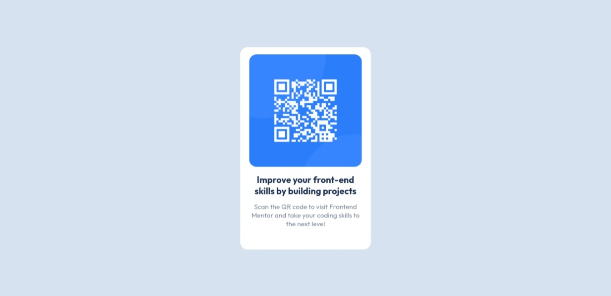

# Frontend Mentor - QR code component solution

This is a solution to the [QR code component challenge on Frontend Mentor](https://www.frontendmentor.io/challenges/qr-code-component-iux_sIO_H). Frontend Mentor challenges help you improve your coding skills by building realistic projects. 

## 
 This is my solution to my first Frontend Mentor Challenges built with React.js and Vanilla CSS.

### screenshot

### Links 

- Live Site URL: [Add live site URL here](https://qr-code-solution-gamma.vercel.app)

### Built with
- Semantic HTML5 markup
- CSS3
- Flexbox
- [React](https://react.dev) - JavaScript Library
